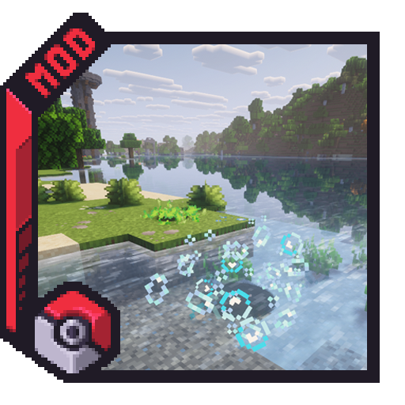

<div align="center">
  

# Rustling Spots

### Bring Gen 5 rustling encounters into Cobblemon

[](https://www.minecraft.net/)
[](https://fabricmc.net/)
[](https://neoforged.net/)
[](./LICENSE)

[CurseForge](https://www.curseforge.com/minecraft/mc-mods/rustling-spots) · [Modrinth](https://modrinth.com/mod/cobblemon-rustling-spots) · [Documentation](./docs/rustling-spots-wiki.md)

</div>

---

## About

**Rustling Spots** is a Cobblemon exploration mod inspired by the rustling grass system from **Pokémon Black & White**.

Temporary spots appear dynamically around players while they explore. Each spot is represented directly in the world through visual effects and can trigger a **Cobblemon encounter**, **themed loot**, a **shiny reward**, or an optional **empty result** depending on the active configuration.

Rustling Spots does **not** modify world generation, making it safe to add to existing worlds.

## Features

- Dynamic temporary encounters during exploration
- Cobblemon-focused Pokémon encounters and themed rewards
- **9 built-in spot families** with separate surfaces, visuals and pools
- Fully configurable server, client, family, Pokémon and sound settings
- Configurable shiny spots and global shiny announcements
- Optional empty spots and multiple reward rolls
- Per-player message preferences
- Player and server spot limits designed for multiplayer environments
- Admin spawning, reload, statistics and scan/debug commands
- Datapack-driven **custom spot definitions**
- Custom biome, block and dimension rules
- Custom Pokémon and loot families
- Weighted custom particles and spot selection
- Active spot resynchronization after login, respawn and dimension changes
- Invalid JSON configuration backup before defaults are regenerated
- No worldgen changes

## Built-in Spot Families

| Family | Typical Surface | Theme |
| --- | --- | --- |
| **Grass** | Grass, paths and small flowers | General outdoor encounters |
| **Sand** | Sand and red sand | Desert species, fossils and dry loot |
| **Water** | Source water with open space above | Aquatic Pokémon and water rewards |
| **Snow** | Snow, snow blocks and powder snow | Ice-themed encounters and rewards |
| **Leaves** | Blocks tagged as leaves | Forest encounters and lightweight spots |
| **Cave** | Stone and deepslate cave surfaces | Underground encounters and mining loot |
| **Flying** | Open air beneath the sky | Flying encounters and high-altitude themes |
| **NetherFlamme** | Netherrack or source lava | Fire and Nether-themed rewards |
| **SoulFlame** | Soul sand and soul soil | Dark, spectral and soul-themed encounters |

Each family can be independently enabled, disabled or rebalanced through configuration.

## Installation

### Requirements

- **Minecraft 1.21.1**
- **Java 21**
- **Cobblemon**
- **Fabric** or **NeoForge**

Fabric builds also use Fabric API and Architectury API as declared by the project metadata.

Download release builds from:

- [CurseForge](https://www.curseforge.com/minecraft/mc-mods/rustling-spots)
- [Modrinth](https://modrinth.com/mod/cobblemon-rustling-spots)

Install the appropriate loader build in your `mods` folder together with its required dependencies.

## Configuration

Rustling Spots exposes several JSON configuration files under:

```text
config/rustlingspots/
```

| File | Purpose |
| --- | --- |
| `rustlingspots-server.json` | Global behavior, radius, lifetime, limits, shiny and reward settings |
| `rustlingspots-pokemon.json` | Pokémon encounter chances, levels and spawn rules |
| `rustlingspots-client.json` | Client display and message preferences |
| `rustlingspots-sound.json` | Reward sound volumes |
| `rustlingspots-families.json` | Spawn multipliers for built-in families |

If a configuration file contains invalid JSON, Rustling Spots backs it up with an `.invalid.bak` suffix before restoring valid defaults.

## Commands

### Player

```mcfunction
/rustlingspots messages
/rustlingspots messages on
/rustlingspots messages off
/rustlingspots messages pokemon on
/rustlingspots messages loot off
/rustlingspots messages empty on
```

### Admin and Debug

```mcfunction
/rustlingspots spawn grass
/rustlingspots spawn rustlingspots:grass
/rustlingspots spawn <namespace:spot_id>
/rustlingspots spawnshiny rustlingspots:grass
/rustlingspots reload
/rustlingspots stats
/rustlingspots stats <player>
/rustlingspots scan 64
/rustlingspots scan 64 grass
```

`spawn` supports both built-in families and complete custom spot IDs. `reload` reloads configuration, family rules, loot pools, Pokémon pools and datapack spot definitions.

## Custom Spots via Datapacks

Rustling Spots includes a full data-driven system for creating custom spots without writing a Java addon.

Custom definitions can control:

- biome matching
- block and surface matching
- dimension matching
- selection priority and weight
- visual family
- custom particle sets
- Pokémon reward families
- loot reward families
- shiny behavior

## Documentation

English is the primary documentation language for this repository.

- [Rustling Spots Wiki, English](./docs/rustling-spots-wiki.md)
- [Rustling Spots Wiki, Français](./docs/rustling-spots-wiki-fr.md)
- [Custom Spot Definitions Guide, English](./docs/custom-spot-definitions-guide-en.md)
- [Custom Spot Definitions Guide, Français](./docs/custom-spot-definitions-guide.md)

A ready-to-use example datapack is available in:

```text
example_datapacks/custom_swamp_spot_pack
```

Official example datapack downloads:

- [CurseForge - Rustling Spots Example Addon Datapack](https://www.curseforge.com/minecraft/data-packs/rustling-spots-example-addon-datapack)
- [Modrinth - Rustling Spots Addon Datapack](https://modrinth.com/datapack/rustling-spots-addon-datapack)

## Official Add-ons

### Rustling Spots: Team Rocket

**Rustling Spots: Team Rocket** is the official dedicated Team Rocket add-on for Rustling Spots, bringing Team Rocket-themed encounters into the Rustling Spots gameplay loop.

- [CurseForge - Rustling Spots: Team Rocket](https://www.curseforge.com/minecraft/mc-mods/rs-teamrocket-addon)
- [Modrinth - Rustling Spots: Team Rocket](https://modrinth.com/mod/rs-teamrocket-addon)

## Project Structure

This repository is a multi-loader project built around Architectury:

```text
.
├── common/       Shared game logic and resources
├── fabric/       Fabric loader implementation
├── neoforge/     NeoForge loader implementation
├── docs/         Project and datapack documentation
└── example_datapacks/
```

The current source tree targets **Minecraft 1.21.1** and **Java 21**.

## Building from Source

Clone the repository and run the Gradle build from the project root.

### Windows

```powershell
.\gradlew.bat build
```

### Linux / macOS

```bash
./gradlew build
```

Loader-specific artifacts are generated from the Fabric and NeoForge modules under their respective `build/libs` directories.

## Changelog

Loader-specific v4.3 changelogs are available here:

- [Fabric changelog](./CHANGELOG-FABRIC.md)
- [NeoForge changelog](./CHANGELOG-NEOFORGE.md)

## License

Rustling Spots is distributed under the **Mozilla Public License 2.0**.

See [LICENSE](./LICENSE) for the complete license text.

---

<div align="center">

**Rustling Spots** by **OurStory × LevelsFR**

</div>
